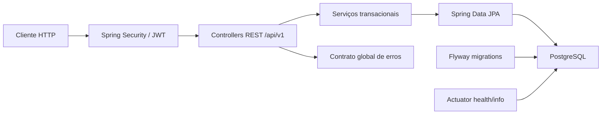
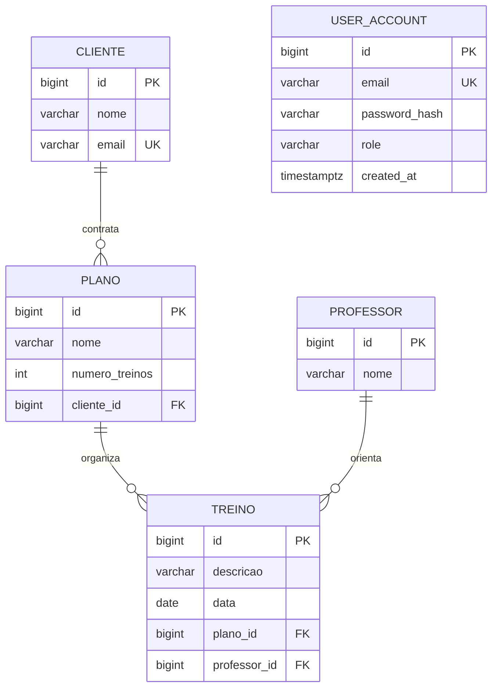

# GymFlow API

Backend REST para administrar clientes, professores, planos e treinos de uma academia, com autenticação JWT, autorização por papéis e persistência PostgreSQL versionada.

> O repositório remoto ainda se chama `API---Treino`. **GymFlow API** é a identidade do produto; nenhuma renomeação remota foi realizada nesta fase.

## Visão executiva

O GymFlow transforma um CRUD acadêmico em uma API backend executável e verificável, próxima de um cenário profissional. A solução protege o domínio com menor privilégio, separa contratos HTTP de entidades, migra o schema de forma determinística e oferece documentação, health check, containers e CI.

Principais capacidades:

- CRUD REST versionado para clientes, professores, planos e treinos
- paginação e filtros por atributos úteis do domínio
- cadastro e login com senhas BCrypt e access tokens JWT curtos
- RBAC com papéis `USER` e `ADMIN`
- PostgreSQL com migrations Flyway e validação de schema pelo Hibernate
- erros HTTP consistentes, sem stack trace no contrato
- OpenAPI/Swagger, Actuator, logs JSON no perfil `prod` e imagem Docker não-root
- testes unitários, HTTP e de integração com PostgreSQL real via Testcontainers

## Problema e solução

Academias precisam relacionar alunos, profissionais, planos contratados e atividades agendadas sem perder integridade ou expor operações administrativas. O GymFlow mantém essas relações no PostgreSQL e oferece uma fronteira HTTP baseada em DTOs, validação de entrada e autorização explícita.



### Modelo de dados



As associações JPA são unidirecionais. Os contratos externos usam DTOs e mapeadores manuais, evitando recursão de serialização, lazy loading acidental e acoplamento entre banco e API.

## Stack

- Java 21
- Spring Boot 4.1
- Spring MVC, Bean Validation e Spring Data JPA
- Spring Security, OAuth2 Resource Server e JWT HMAC-SHA256
- PostgreSQL 17 e Flyway
- springdoc-openapi / Swagger UI
- Spring Boot Actuator e logging estruturado ECS
- Maven Wrapper e JaCoCo
- JUnit, Mockito, MockMvc e Testcontainers
- Docker, Docker Compose e GitHub Actions

## Segurança

| Recurso | Acesso |
| --- | --- |
| `POST /api/v1/auth/register` | público; cria somente `USER` |
| `POST /api/v1/auth/login` | público |
| `GET /actuator/health`, `GET /actuator/info` | público, sem detalhes sensíveis |
| OpenAPI e Swagger UI | público |
| `GET /api/v1/**` | `USER` ou `ADMIN` |
| `POST`, `PUT`, `DELETE /api/v1/**` | somente `ADMIN` |
| demais rotas | autenticadas por padrão |

O `JWT_SECRET` é obrigatório, deve estar em Base64 e representar no mínimo 256 bits. A aplicação falha no startup se o segredo estiver ausente, inválido ou curto. Não existe segredo funcional padrão.

Uma conta `ADMIN` pode ser criada no primeiro startup por `ADMIN_EMAIL` e `ADMIN_PASSWORD`. As duas variáveis são opcionais, mas devem ser fornecidas juntas; a senha precisa ter entre 12 e 72 caracteres. Nenhuma credencial administrativa está embutida no código.

Refresh token não foi incluído: access tokens expiram em 15 minutos por padrão e o projeto não possui requisito de sessão longa. A decisão evita introduzir armazenamento, rotação e revogação de tokens sem uma necessidade demonstrada.

## Como executar com Docker

Pré-requisito: Docker com Compose.

1. Copie o exemplo e preencha apenas o arquivo local ignorado pelo Git:

```bash
cp .env.example .env
```

2. Defina pelo menos:

```dotenv
DB_PASSWORD=<senha-local-forte>
JWT_SECRET=<base64-de-32-bytes-aleatorios>
```

Gere o segredo sem reutilizar senhas:

```bash
openssl rand -base64 32
```

3. Suba a aplicação:

```bash
docker compose up --build
```

Serviços disponíveis:

- API: `http://localhost:8080`
- Swagger UI: `http://localhost:8080/swagger-ui.html`
- OpenAPI JSON: `http://localhost:8080/v3/api-docs`
- Health: `http://localhost:8080/actuator/health`

O Compose exige `DB_PASSWORD` e `JWT_SECRET`, aguarda o PostgreSQL ficar saudável e inicia a API com o perfil `prod`. A imagem final usa JRE 21, camadas do Spring Boot e usuário sem privilégios.

## Como executar localmente

Pré-requisitos: JDK 21, Docker e PowerShell ou shell compatível.

Com as variáveis do `.env` exportadas para o processo, inicie apenas o PostgreSQL e depois a API:

```bash
docker compose up -d postgres
./mvnw spring-boot:run
```

No Windows:

```powershell
$env:DB_URL = "jdbc:postgresql://localhost:5432/gymflow"
$env:DB_USERNAME = "gymflow"
$env:DB_PASSWORD = "<senha-local-forte>"
$env:JWT_SECRET = "<base64-de-32-bytes-aleatorios>"
.\mvnw.cmd spring-boot:run
```

## Fluxo de autenticação

Cadastre um usuário comum:

```bash
curl -X POST http://localhost:8080/api/v1/auth/register \
  -H "Content-Type: application/json" \
  -d '{"email":"dev@example.test","password":"<senha-local-com-12-ou-mais-caracteres>"}'
```

Faça login e use o `accessToken` retornado:

```bash
curl -X POST http://localhost:8080/api/v1/auth/login \
  -H "Content-Type: application/json" \
  -d '{"email":"dev@example.test","password":"<senha-local-com-12-ou-mais-caracteres>"}'

curl http://localhost:8080/api/v1/clientes \
  -H "Authorization: Bearer <accessToken>"
```

Os exemplos usam o domínio reservado `.test` e valores exclusivamente locais.

## Endpoints de domínio

Todos os recursos usam o prefixo `/api/v1`, aceitam paginação com `page`, `size` e `sort` e retornam DTOs.

| Recurso | Endpoints | Filtros |
| --- | --- | --- |
| Clientes | `GET/POST /clientes`, `GET/PUT/DELETE /clientes/{id}` | `nome`, `email` |
| Professores | `GET/POST /professores`, `GET/PUT/DELETE /professores/{id}` | `nome` |
| Planos | `GET/POST /planos`, `GET/PUT/DELETE /planos/{id}` | `clienteId` |
| Treinos | `GET/POST /treinos`, `GET/PUT/DELETE /treinos/{id}` | `planoId` |

Criações retornam `201 Created` com `Location`; exclusões bem-sucedidas retornam `204 No Content`. Erros usam o mesmo formato com `timestamp`, `status`, `error`, `message`, `path` e violações por campo quando aplicável.

## Configuração

| Variável | Obrigatória | Padrão | Finalidade |
| --- | --- | --- | --- |
| `DB_URL` | não | `jdbc:postgresql://localhost:5432/gymflow` | URL JDBC |
| `DB_USERNAME` | não | `gymflow` | usuário do banco |
| `DB_PASSWORD` | sim | nenhum | senha do banco |
| `JWT_SECRET` | sim | nenhum | chave HMAC Base64 com ≥ 256 bits |
| `JWT_ISSUER` | não | `gymflow-api` | emissor validado do token |
| `JWT_ACCESS_TOKEN_TTL` | não | `PT15M` | duração ISO-8601 do access token |
| `ADMIN_EMAIL` | não | vazio | e-mail do bootstrap administrativo |
| `ADMIN_PASSWORD` | não | vazio | senha do bootstrap administrativo |
| `SERVER_PORT` | não | `8080` | porta HTTP |

## Testes e qualidade

O gate local e da CI executa testes unitários, contratos MVC, autenticação/RBAC e integração com PostgreSQL 17 real:

```bash
./mvnw clean verify
```

O Testcontainers valida as migrations Flyway, o schema Hibernate, relacionamentos JPA e o fluxo HTTP de segurança. O JaCoCo gera `target/site/jacoco/index.html` e impede cobertura inferior a 75% de linhas ou 40% de branches.

Também foram validados localmente:

```bash
docker compose config --quiet
docker build -t gymflow-api:local .
```

## Estrutura

```text
src/main/java/com/renatoboranga/gymflow/
├── config/       # segurança, propriedades e OpenAPI
├── controller/   # fronteira HTTP
├── dto/          # contratos de entrada e saída
├── exception/    # erros consistentes
├── mapper/       # mapeamento explícito DTO ↔ entidade
├── model/        # entidades e papéis
├── repository/   # persistência JPA
├── security/     # JWT, UserDetails e bootstrap
└── service/      # casos de uso e transações
```

As decisões arquiteturais estão registradas em [`docs/adr`](docs/adr).

## Decisões e limites conscientes

- MapStruct não foi adotado: quatro agregados possuem mapeamentos curtos, explícitos e sem repetição que justifique geração de código.
- Cache não foi adicionado: não há medição de gargalo ou padrão de leitura que compense invalidação e complexidade operacional.
- Não há refresh token: tokens curtos atendem ao escopo atual com menor superfície de ataque.
- Não há mensageria, Redis, Kubernetes ou microsserviços: o modular monolith atual é suficiente para o domínio e mais fácil de operar.
- O bootstrap de `ADMIN` é apropriado para demonstração/local; produção deveria integrar um provedor de identidade ou fluxo administrativo auditável.

## Roadmap

- substituir o bootstrap administrativo por gestão de identidade dedicada
- adicionar testes de carga antes de decidir por cache
- avaliar auditoria persistente para mutações administrativas
- publicar imagem versionada e SBOM quando houver autorização de release
- renomear o repositório remoto para `gymflow-api`, somente com autorização explícita

## Autor

Renato Boranga
