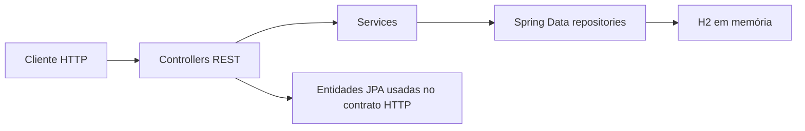

# GymFlow API

API REST para gerenciar clientes, professores, planos e treinos de uma academia.

> O repositório ainda se chama `API---Treino`. **GymFlow API** é a identidade editorial recomendada; nenhuma renomeação remota foi realizada.

## Estado atual

Este é um projeto acadêmico em evolução. A versão atual demonstra uma aplicação em camadas com Java 17, Spring Boot, Spring Web, Spring Data JPA, Bean Validation e H2. PostgreSQL, Docker, segurança e observabilidade aparecem somente no roadmap — ainda não fazem parte da implementação.

## Problema

Informações de alunos, profissionais e rotinas de treino precisam ser relacionadas e consultadas de forma consistente. O projeto modela esse domínio e expõe operações CRUD por HTTP.

## Solução

A API organiza quatro entidades principais:

- `Cliente`: aluno identificado por nome e e-mail
- `Professor`: profissional responsável por treinos
- `Plano`: plano associado a um cliente
- `Treino`: atividade associada a um plano e a um professor

## Arquitetura atual



```text
src/main/java/com/empresa/apiTreino/
├── controller/   # endpoints HTTP
├── service/      # operações da aplicação
├── repository/   # acesso a dados com JpaRepository
├── model/        # entidades JPA e validações
└── exception/    # exceção de recurso não encontrado
```

## Stack implementada

- Java 17
- Spring Boot 2.5.4
- Spring Web
- Spring Data JPA / Hibernate
- Bean Validation
- H2 em memória
- Maven
- JUnit 5 e Mockito

## Endpoints atuais

| Recurso | Operações |
| --- | --- |
| Clientes | `GET /clientes`, `GET /clientes/{id}`, `POST /clientes`, `PUT /clientes/{id}`, `DELETE /clientes/{id}` |
| Professores | `GET /professores`, `GET /professores/{id}`, `POST /professores`, `PUT /professores/{id}`, `DELETE /professores/{id}` |
| Planos | `GET /planos`, `GET /planos/{id}`, `POST /planos`, `PUT /planos/{id}`, `DELETE /planos/{id}` |
| Treinos | `GET /treinos`, `GET /treinos/{id}`, `POST /treinos`, `PUT /treinos/{id}`, `DELETE /treinos/{id}` |

Os contratos atuais recebem e retornam as próprias entidades JPA. A separação entre DTOs e entidades pertence à próxima etapa de modernização.

Recursos inexistentes são tratados de forma centralizada por `GlobalExceptionHandler` e retornam `404 Not Found` com `timestamp`, `status`, `error`, `message` e `path`.

## Como executar

### Pré-requisitos

- JDK 17
- Maven 3.8+

```bash
git clone https://github.com/RenatoBoranga1/API---Treino.git
cd API---Treino
mvn spring-boot:run
```

A API fica disponível em `http://localhost:8080`. O H2 Console de desenvolvimento fica em `http://localhost:8080/h2-console`.

As credenciais atuais do H2 são exclusivamente locais e demonstrativas. O projeto não deve ser usado em produção com essa configuração.

## Testes

A suíte atual contém dois testes unitários de `ClienteServiceImpl` e um teste HTTP do contrato `404 Not Found`.

```bash
mvn test
```

Para validar também o empacotamento:

```bash
mvn clean package
```

O caso de cliente inexistente lança `ResourceNotFoundException` no serviço e é convertido pelo handler global em resposta HTTP 404.

## Limitações conhecidas

- Spring Boot 2.5.4 está desatualizado e será atualizado de forma controlada
- persistência somente em H2, recriada a cada execução
- entidades JPA expostas diretamente nos contratos REST
- tratamento global cobre recursos inexistentes; outros erros HTTP ainda precisam de contratos próprios
- cobertura de testes restrita a uma parte do serviço de clientes
- sem paginação, filtros, documentação OpenAPI, autenticação ou autorização
- sem Docker, migrations, CI/CD ou observabilidade

## Roadmap

Itens futuros, ainda não implementados:

1. atualizar para Java 21 e uma versão estável atual do Spring Boot
2. adotar PostgreSQL e Flyway com configuração externa por ambiente
3. separar DTOs de entidades; avaliar MapStruct onde reduzir mapeamento repetitivo
4. ampliar a padronização para validações e demais respostas de erro
5. adicionar paginação, filtros e OpenAPI/Swagger
6. criar Dockerfile, Docker Compose e health check
7. ampliar testes unitários e adicionar testes de integração com Testcontainers
8. configurar CI/CD e logging estruturado
9. somente depois da base: Spring Security, JWT, refresh token e RBAC
10. avaliar cache e observabilidade conforme necessidades comprovadas

## Autor

Renato Boranga
